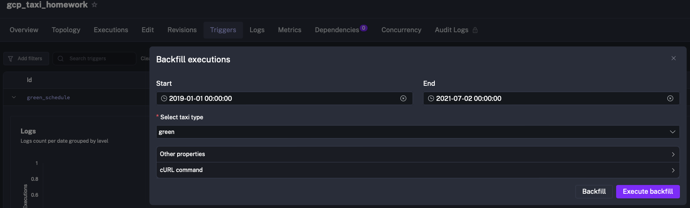
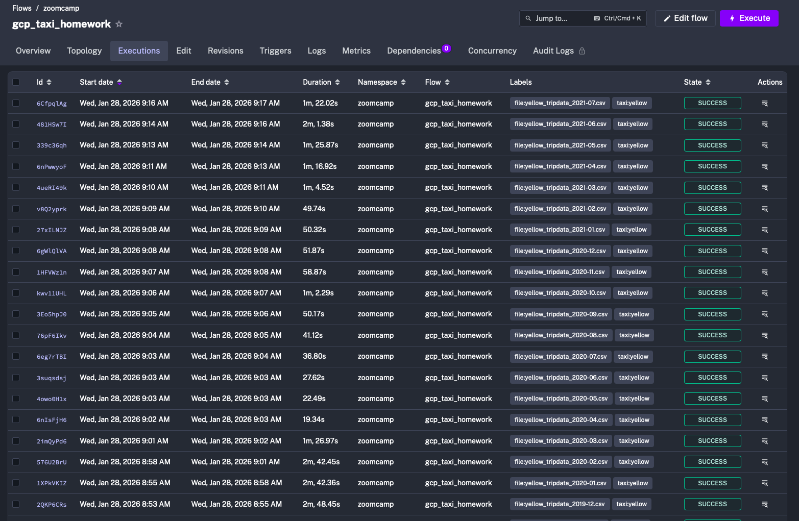
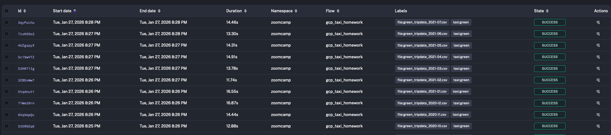
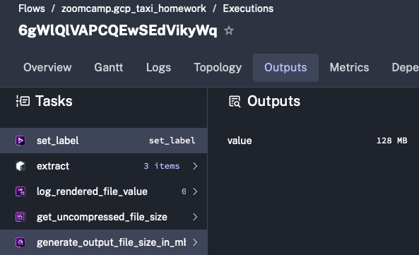
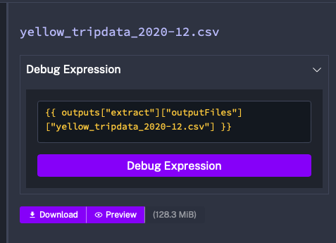
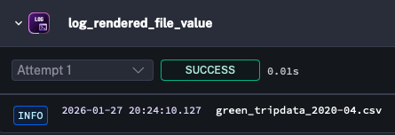
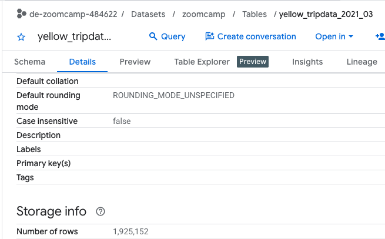

## Module 2 Homework: Workflow Orchestration (Kestra)

### Assignment

So far in the course, we processed data for the year 2019 and 2020. Your task is to extend the existing flows to include data for the year 2021.


### Implementation

Backfill (Used in this solution)

I used Kestra’s Backfill feature in the scheduled flow to run all periods automatically since I didn´t have them all before the homework ssignment.

Backfill range:

2019-01-01 → 2021-07-02

Executed for both yellow and green taxi datasets

This approach allows Kestra to automatically generate executions for each month in the selected range.


Yellow Executions:

Green Executions:


### Quiz Questions

Complete the quiz shown below. It's a set of 6 multiple-choice questions to test your understanding of workflow orchestration, Kestra, and ETL pipelines.

1. Within the execution for `Yellow` Taxi data for the year `2020` and month `12`: what is the uncompressed file size (i.e. the output file `yellow_tripdata_2020-12.csv` of the `extract` task)?

- 128.3 MiB
- 134.5 MiB
- 364.7 MiB
- 692.6 MiB

**Answer: 128.3**

To make this visible in Kestra, I added the following tasks:

```yaml
 - id: get_uncompressed_file_size
      type: io.kestra.plugin.core.storage.Size
      uri: "{{render(vars.data)}}"

    - id: generate_output_file_size_in_mb
      type: io.kestra.plugin.core.debug.Return
      format: "{{outputs.get_uncompressed_file_size.size / (1024*1024)}} MiB"
```

This exposes the size directly in the execution outputs.



I also temporarily disabled the file purge task so the extracted file remained available:



2. What is the rendered value of the variable `file` when the inputs `taxi` is set to `green`, `year` is set to `2020`, and `month` is set to `04` during execution?

- `{{inputs.taxi}}_tripdata_{{inputs.year}}-{{inputs.month}}.csv`
- `green_tripdata_2020-04.csv`
- `green_tripdata_04_2020.csv`
- `green_tripdata_2020.csv`

**Answer: green_tripdata_2020-04.csv**

This was validated two ways:
From execution UI:


From an explicit log task

```yaml
- id: "log_rendered_file_value"
  type: "io.kestra.plugin.core.log.Log"
  level: INFO
  message: "{{render(vars.file)}}"
```



3. How many rows are there for the `Yellow` Taxi data for all CSV files in the year 2020?

- 13,537.299
- 24,648,499
- 18,324,219
- 29,430,127

**Answer: 24,648,499**

BigQuery query used:

```sql
SELECT count(*)
FROM `de-zoomcamp-484622.zoomcamp.yellow_tripdata`
WHERE filename like "yellow_tripdata_2020%"
```

Cross-checked using partitioned timestamp:

```sql
SELECT count(*)
FROM `de-zoomcamp-484622.zoomcamp.yellow_tripdata`
WHERE lpep_pickup_datetime >= TIMESTAMP("2020-01-01")
  AND lpep_pickup_datetime < TIMESTAMP("2021-01-01")
```

4. How many rows are there for the `Green` Taxi data for all CSV files in the year 2020?

- 5,327,301
- 936,199
- 1,734,051
- 1,342,034

**Answer: 1,734,051**

BigQuery query used:

```sql
SELECT count(*)
FROM `de-zoomcamp-484622.zoomcamp.green_tripdata`
WHERE filename like "green_tripdata_2020%"
```

Validation using timestamp partition:

```sql
SELECT count(*)
FROM `de-zoomcamp-484622.zoomcamp.green_tripdata`
WHERE lpep_pickup_datetime >= TIMESTAMP("2020-01-01")
  AND lpep_pickup_datetime < TIMESTAMP("2021-01-01")
```

5. How many rows are there for the `Yellow` Taxi data for the March 2021 CSV file?

- 1,428,092
- 706,911
- 1,925,152
- 2,561,031

**Answer: 1,925,152**

This value was verified directly from the BigQuery table:


6. How would you configure the timezone to New York in a Schedule trigger?

- Add a `timezone` property set to `EST` in the `Schedule` trigger configuration
- Add a `timezone` property set to `America/New_York` in the `Schedule` trigger configuration
- Add a `timezone` property set to `UTC-5` in the `Schedule` trigger configuration
- Add a `location` property set to `New_York` in the `Schedule` trigger configuration

**Answer: Add a `timezone` property set to `America/New_York` in the `Schedule` trigger configuration**

```yaml
triggers:
    - id: green_schedule
      type: io.kestra.plugin.core.trigger.Schedule
      cron: "0 9 1 * *"
      timezone: "America/New_York" # Configured timezone for New York
      inputs:
          taxi: green

    - id: yellow_schedule
      type: io.kestra.plugin.core.trigger.Schedule
      cron: "0 10 1 * *"
      timezone: "America/New_York" # Configured timezone for New York
      inputs:
          taxi: yellow
```
