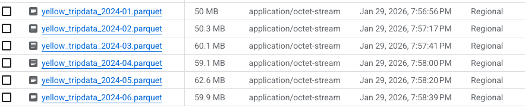
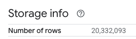
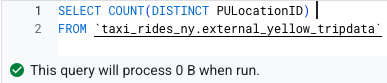
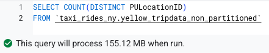
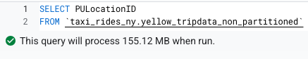
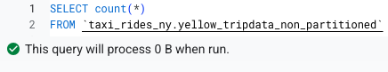

# Module 1 Homework: Data Warehouse and BigQuery

## Environment setup

Create a virtual environment and install required packages:

```bash
uv init --python=3.13
uv add google-cloud-storage requests
```

## Download and Upload data

Run the ingestion script to get the Yellow Taxi Trip Records for \*\*January 2024 - June 2024 Parquet Files from the New York City Taxi Data found here: https://www.nyc.gov/site/tlc/about/tlc-trip-record-data.page

```bash
uv run main.py
```

make sure that all 6 files show in your GCS Bucket before beginning.



<b>BIG QUERY SETUP:</b></br>
Create an external table using the Yellow Taxi Trip Records. </br>

```sql
CREATE OR REPLACE EXTERNAL TABLE `taxi_rides_ny.external_yellow_tripdata`
OPTIONS (
  format = 'PARQUET',
  uris = ['gs://de-zoomcamp-484622-ny-taxi/yellow_tripdata_2024-*.parquet']
);

```

Create a (regular/materialized) table in BQ using the Yellow Taxi Trip Records (do not partition or cluster this table). </br>

```sql
CREATE OR REPLACE TABLE taxi_rides_ny.yellow_tripdata_non_partitioned AS
SELECT * FROM taxi_rides_ny.external_yellow_tripdata;
```

</p>

## Question 1:

What is count of records for the 2024 Yellow Taxi Data?

- 65,623
- 840,402
- 20,332,093
- 85,431,289

**Answer: 20,332,093**



## Question 2:

Write a query to count the distinct number of PULocationIDs for the entire dataset on both the tables.</br>
What is the **estimated amount** of data that will be read when this query is executed on the External Table and the Table?

- 18.82 MB for the External Table and 47.60 MB for the Materialized Table
- 0 MB for the External Table and 155.12 MB for the Materialized Table
- 2.14 GB for the External Table and 0MB for the Materialized Table
- 0 MB for the External Table and 0MB for the Materialized Table

**Answer: 0 MB for the External Table and 155.12 MB for the Materialized Table**

```sql
SELECT COUNT(DISTINCT PULocationID)
FROM `taxi_rides_ny.external_yellow_tripdata`

SELECT COUNT(DISTINCT PULocationID)
FROM `taxi_rides_ny.yellow_tripdata_non_partitioned`
```




## Question 3:

Write a query to retrieve the PULocationID from the table (not the external table) in BigQuery. Now write a query to retrieve the PULocationID and DOLocationID on the same table. Why are the estimated number of Bytes different?

- BigQuery is a columnar database, and it only scans the specific columns requested in the query. Querying two columns (PULocationID, DOLocationID) requires
  reading more data than querying one column (PULocationID), leading to a higher estimated number of bytes processed.
- BigQuery duplicates data across multiple storage partitions, so selecting two columns instead of one requires scanning the table twice,
  doubling the estimated bytes processed.
- BigQuery automatically caches the first queried column, so adding a second column increases processing time but does not affect the estimated bytes scanned.
- When selecting multiple columns, BigQuery performs an implicit join operation between them, increasing the estimated bytes processed

**Answer: BigQuery is a columnar database, and it only scans the specific columns requested in the query. Querying two columns (PULocationID, DOLocationID) requires reading more data than querying one column (PULocationID), leading to a higher estimated number of bytes processed.**

```sql
SELECT  PULocationID
FROM `taxi_rides_ny.yellow_tripdata_non_partitioned`;

SELECT  PULocationID, DOLocationID
FROM `taxi_rides_ny.yellow_tripdata_non_partitioned`;
```




## Question 4:

How many records have a fare_amount of 0?

- 128,210
- 546,578
- 20,188,016
- 8,333

Answer: 8,333

```sql
SELECT count(*)
FROM `taxi_rides_ny.yellow_tripdata_non_partitioned`
WHERE fare_amount = 0
```

## Question 5:

What is the best strategy to make an optimized table in Big Query if your query will always filter based on tpep_dropoff_datetime and order the results by VendorID (Create a new table with this strategy)

- Partition by tpep_dropoff_datetime and Cluster on VendorID
- Cluster on by tpep_dropoff_datetime and Cluster on VendorID
- Cluster on tpep_dropoff_datetime Partition by VendorID
- Partition by tpep_dropoff_datetime and Partition by VendorID

**Answer: Partition by tpep_dropoff_datetime and Cluster on VendorID**

| Feature      | Best use For                                                   |
| ------------ | -------------------------------------------------------------- |
| Partitioning | Columns used in WHERE filters, especially time-based           |
| Clustering   | Columns used in ORDER BY, GROUP BY, JOIN, or selective filters |

```sql
CREATE OR REPLACE TABLE taxi_rides_ny.yellow_tripdata_partitioned_clustered
PARTITION BY DATE(tpep_dropoff_datetime)
CLUSTER BY VendorID AS
SELECT * FROM taxi_rides_ny.external_yellow_tripdata;
```

## Question 6:

Write a query to retrieve the distinct VendorIDs between tpep_dropoff_datetime
2024-03-01 and 2024-03-15 (inclusive)</br>

Use the materialized table you created earlier in your from clause and note the estimated bytes. Now change the table in the from clause to the partitioned table you created for question 5 and note the estimated bytes processed. What are these values? </br>

Choose the answer which most closely matches.</br>

- 12.47 MB for non-partitioned table and 326.42 MB for the partitioned table
- 310.24 MB for non-partitioned table and 26.84 MB for the partitioned table
- 5.87 MB for non-partitioned table and 0 MB for the partitioned table
- 310.31 MB for non-partitioned table and 285.64 MB for the partitioned table

**Answer: 310.24 MB for non-partitioned table and 26.84 MB for the partitioned table**

```sql
SELECT DISTINCT VendorID
FROM `taxi_rides_ny.yellow_tripdata_non_partitioned`
WHERE tpep_dropoff_datetime BETWEEN '2024-03-01' AND '2024-03-15';

SELECT DISTINCT VendorID
FROM `taxi_rides_ny.yellow_tripdata_partitioned_clustered`
WHERE tpep_dropoff_datetime BETWEEN '2024-03-01' AND '2024-03-15' ;
```


## Question 7:

Where is the data stored in the External Table you created?

- Big Query
- Container Registry
- GCP Bucket
- Big Table

**Answer: GCP Bucket**

## Question 8:

It is best practice in Big Query to always cluster your data:

- True
- False

**Answer: False, it depends**

Clustering is not always a best practice in BigQuery.

We should cluster only when:

- Frequently filter, join, or order by the same column(s)
- The column has high cardinality (many distinct values)
- Queries repeatedly scan subsets of data

When clustering hurts (or does nothing)

- On low-cardinality columns (like VendorID with values 1 or 2)
- On columns rarely used in filters
- On small tables
- On highly volatile data (frequent rewrites cause reclustering cost)

Clustering also adds:

- Write cost
- Maintenance cost (reclustering)

## (Bonus: Not worth points) Question 9:

No Points: Write a `SELECT count(*)` query FROM the materialized table you created. How many bytes does it estimate will be read? Why?

0 bytes. Because this table is a materialized table that has row-count metadata and it is not being filtered by any column.

```sql
SELECT COUNT(*)
FROM `taxi_rides_ny.yellow_tripdata_non_partitioned`
```


